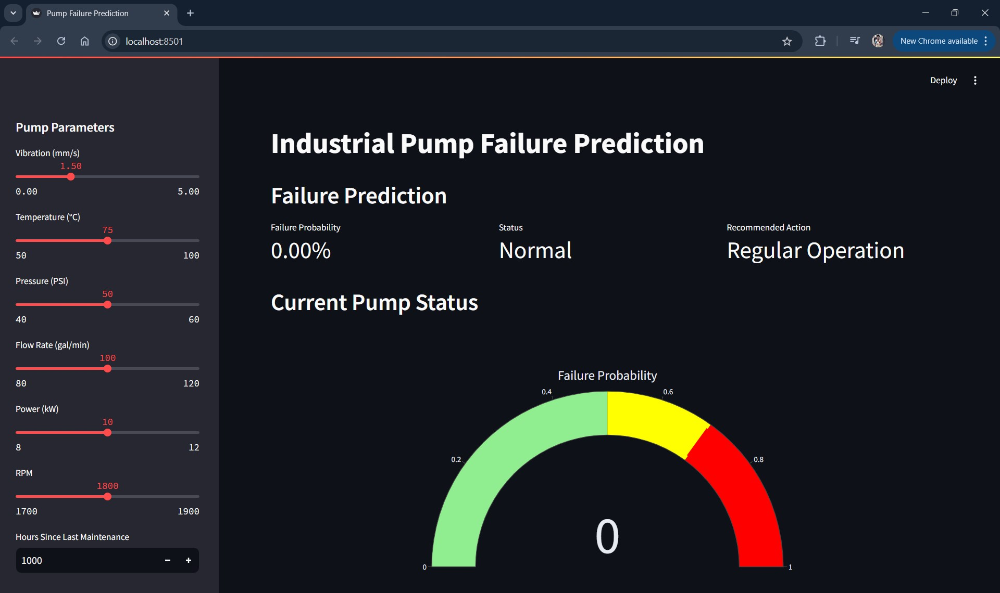
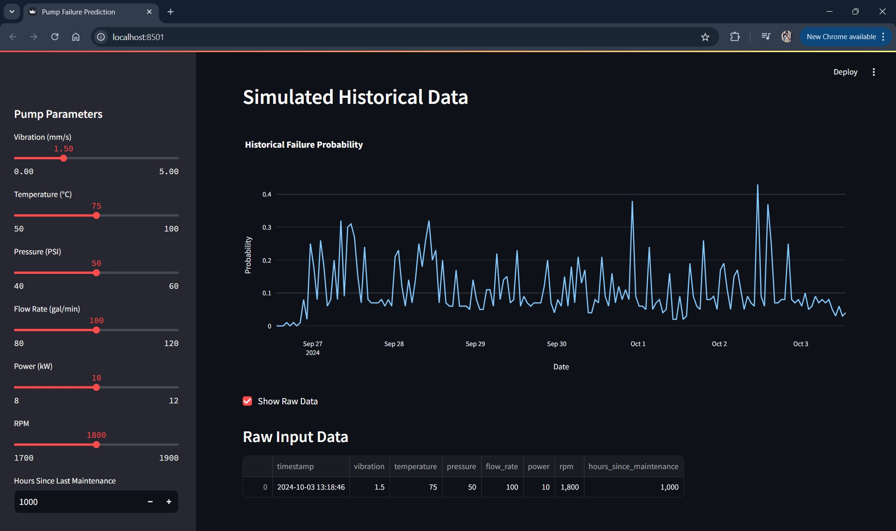

# MLOps-PumpMaintenance-Dashboard using Streamlit | Docker | AWS

This project demonstrates a predictive maintenance system for industrial pumps using Streamlit, Docker, AWS.

## Setup

1. Clone this repository
2. Install dependencies: `pip install -r requirements.txt`
3. Generate synthetic data: `python src/data_generator.py`
4. Train the model: `python src/train_model.py`
5. Run the Streamlit app: `streamlit run app.py`

## Docker Deployment

To deploy using Docker:

1. Build the Docker image: `docker build -t predictive-maintenance .`
2. Run the Docker container: `docker run -p 8501:8501 predictive-maintenance`

The app will be available at http://localhost:8501

## AWS EC2 Deployment ( for reference, watch this video : https://www.youtube.com/watch?v=qNIniDftAcU )
-The following steps below only work if your local machine has same cpu arch as the ec2 instance (x86 or arm)-

1. Launch an EC2 instance (t2.micro for free tier)
2. Install Docker on the EC2 instance
3. Copy your project files to the EC2 instance
4. Build and run the Docker container as `docker build -t ec2-predictive-maintenance:v1.0 .` from project directory
5. Now we need to save the image as a tarball to compress the artifact before uploading it to the ec2 instance.
   use command : `docker save -o ec2-predictive-maintenance.tar ec2-predictive-maintenance:v1.0` and now there should be a new tar file in the project directory.
6. Upload the tar file to the ec2 instance using scp as ` scp -i vs-kp-1.pem ec2-predictive-maintenance.tar ec2-user@(ip):/home/ec2-user/dockerimages`.
   Make sure to set permission on the .pem file using `chmod 600 vs-kp-1.pem`

I would like to thank Vincent Stevenson for his video on Hosting a docker on AWS EC2 instance.
